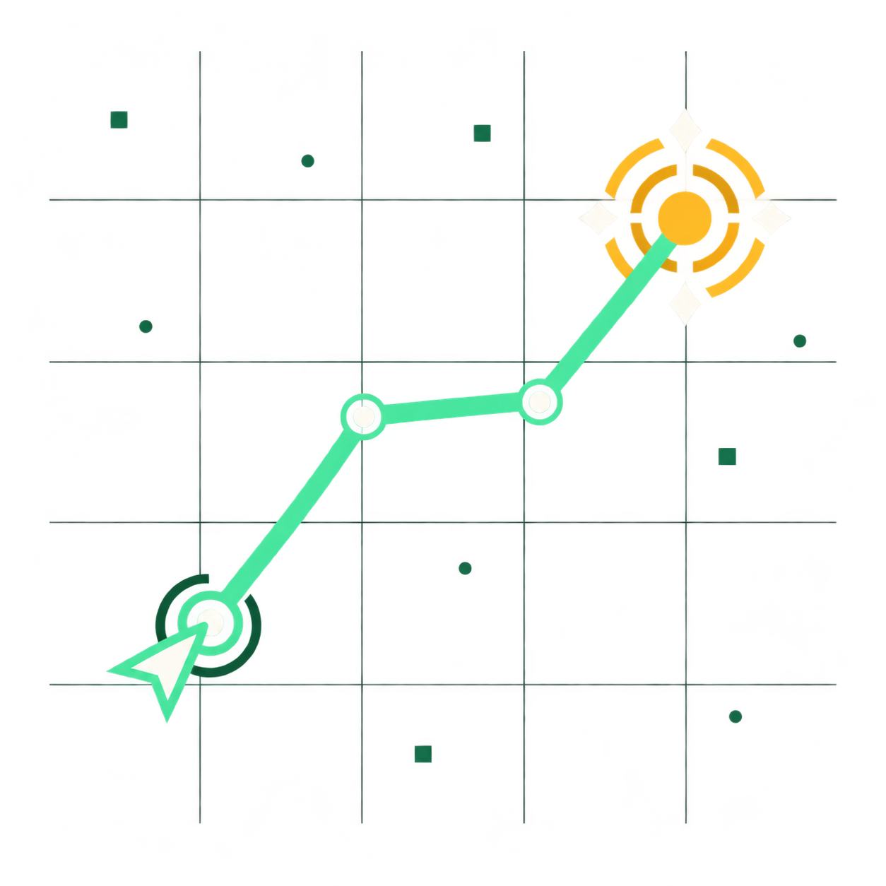
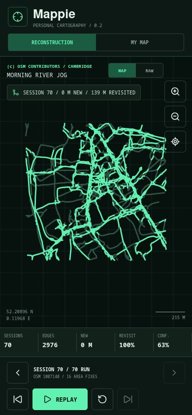

<p align="center">
  
</p>

# Mappie

**The world is blank until you walk through it.**

[Open the live web app](https://mappie-c70.pages.dev)

When I first played _Rewrite_, Mappie was one of those small ideas that stayed with me: a map that begins completely empty and comes into focus only because you actually went somewhere. I kept thinking it would be fun to make a real version someday, so this is that little project.

This Mappie is a personal cartography experiment built around the same feeling. You begin with a blank field. Each walk reveals a little more of the place around you: familiar paths line up, noisy GPS traces settle into shared routes, and a turn into somewhere new becomes another branch. Walk through the same area often enough and a rough, personal map slowly appears.

So when does a map like this become useful? _Rewrite_ gives my favorite answer. Kotarou spends so much time wandering through the forest around Kazamatsuri that Mappie quietly builds up a record of where he has been. Later, when Inoue goes missing, that accumulated map becomes a real help in the search. I have always loved that payoff: a collection of ordinary walks suddenly turns into knowledge of a place that matters.

It is a simple open-source project made for the pleasure of watching familiar places emerge one walk at a time.

<p align="center">
  
</p>

The name and original premise come from the fictional GPS tool in the visual novel _Rewrite_ by Key.

## What works

- A blank, pan-and-zoom vector canvas drawn entirely from explored routes
- Progressive reconstruction from repeated, partially overlapping GPS sessions in one neighborhood
- Raw-observation and merged-map views for inspecting GPS drift and edge confidence
- GPX 1.1 track and route import
- Foreground GPS recording on iOS, Android, and compatible browsers
- Background GPS buffering in iOS/Android development builds
- Local-only archive and interrupted-session recovery
- Accuracy, speed, movement, and timestamp filtering
- Distance, location-fix, session, and live-state telemetry
- Responsive layouts tested in desktop Chromium, desktop Firefox, and at iPhone dimensions

The public replay makes the central loop testable without a physical phone. Step through repeated Cambridge sessions to watch overlap consolidate and new branches extend the map, then switch to `MY MAP` for imported or recorded paths. Personal routes never mix with the bundled demo archive.

## Quick start

Requirements: Node.js 20 or newer and npm.

```bash
npm install
npm run web
```

Open `http://localhost:8081` when Expo is ready. The web build can replay the fixture, import GPX files, and collect foreground browser geolocation when the page is served from localhost or HTTPS.

The production web app is deployed to Cloudflare Pages after every verified push to `main`. See [Deployment](docs/deployment.md) for the pipeline, required repository secrets, and recovery steps.

For an iPhone, install Expo Go and run:

```bash
npm start
```

Scan the QR code from Expo Go. GPX import and foreground recording work there. Background location is intentionally not advertised as working in Expo Go because iOS requires an Expo development build for `TaskManager` background execution.

On macOS with Xcode, create a native development build with:

```bash
npx expo prebuild --platform ios
npx expo run:ios --device
```

The app config already declares the `location` background mode and human-readable permission copy. An Apple Developer signing identity is still required to install a native build on a physical device.

## Verification

```bash
npm run typecheck
npm test
npm run test:e2e
npm run build:web
```

The unit suite covers GPX parsing, GPS rejection rules, distance measurement, time-gap segmentation, viewport projection, graph reconstruction, and the public session registry. The Playwright suite boots the real web bundle in Chromium and Firefox, advances beyond 30 sessions, enforces a bounded SVG DOM, switches between merged and raw geometry, checks horizontal overflow, and exercises the personal-map mode at desktop and iPhone dimensions.

## Architecture

```text
Core Location / browser geolocation / GPX
                    |
                    v
          quality and motion filter
                    |
                    v
       local exploration archive (v1)
                    |
                    v
 simplify -> resample -> spatial snap
                    |
                    v
 observed edge graph -> blank SVG cartography
```

The `src/core` modules have no React Native imports. This keeps parsing, filtering, reconstruction, distance, and rendering geometry independently testable and leaves a clean boundary for a future Rust or native map-matching engine.

See [Architecture](docs/architecture.md) for lifecycle details and the planned road-graph model.

See the [Firefox replay performance case study](docs/performance.md) for the original session-30 slowdown, root-cause analysis, measured before/after results, regression strategy, and reproducible profiling command.

## Privacy model

- No account, analytics, server, advertising SDK, or remote map provider
- Recorded and imported paths stay in the app's local storage
- Background recording starts only from the explicit `EXPLORE` command
- The iOS background-location indicator is enabled
- Clearing `MY MAP` removes the archive, active track, and background buffer

AsyncStorage is suitable for the current prototype. Before storing large histories or an OpenStreetMap edge graph, the archive will move to SQLite with a migration path from schema version 1.

## Public test data

The reconstruction scenario contains 70 OpenStreetMap GPS traces selected from 141 linked candidates in the same compact Cambridge neighborhood. Their source pages are publicly listed as `Identifiable`; the importer crops every trace to a fixed bounding box, preserves re-entry breaks, removes original timestamps, and samples each session to at most 300 ordered points. The sessions deliberately include partial overlap, new entrances, loops, and real GPS drift while excluding obvious bus, car, train, and non-GPS line datasets.

Fixture data is provided under the Open Database License 1.0 with attribution to OpenStreetMap contributors. Application source code is separately licensed under MIT. See [Data attribution](docs/data-attribution.md).

See [Rewrite Mappie reference](docs/rewrite-reference.md) for the source-backed interaction analysis, the fidelity assessment, and the deliberate mobile adaptations.

## Roadmap

- Persist large archives and spatial indexes in SQLite
- Import and export complete archives as GPX/GeoJSON
- Replace proximity graph snapping with a production map-matching pipeline
- Store inferred local edges separately from raw private trajectories
- Persist `UNKNOWN -> OBSERVED -> CONFIRMED` edge state on personal maps
- Compute neighborhood coverage without streaks or leaderboards
- Add battery-aware deferred collection presets and Apple Watch capture

The current graph builder is deliberately local and conservative: it simplifies observations, resamples them in metric space, and snaps nearby fixes into shared nodes. It is a testable baseline for the product loop, not a claim that noisy GPS alone can yet recover production-quality road topology.
